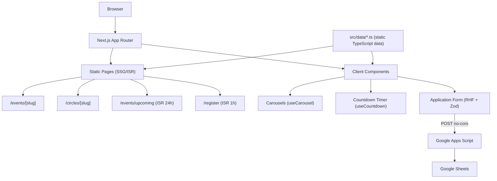

# MEGA Team MU — Official Website

The official website for **MEGA Team MU**, a student volunteer community at the Faculty of Computers and Information, Mansoura University (founded 2018). The site presents the organization's circles, past and upcoming events, podcast (MEGast), board members, and sponsors, and drives membership recruitment via an online application form.

**Live URL:** [https://megateam.vercel.app](https://megateam.vercel.app)

---

## Overview

MEGA (Mansoura Engineering & Growth Association) is a student-led tech community that organizes workshops, projects, events, and mentorship programs for both technical and non-technical students. This repository contains the complete source code for the public-facing website, built with Next.js 16 and TypeScript.

The site is a statically generated, SEO-first web application with no backend, no database, and no authentication. All content (events, circles, board members, episodes, quotes) is stored as typed TypeScript data files and rendered at build time. The one dynamic integration is the membership application form, which submits to a Google Apps Script endpoint and stores responses in a Google Sheet.

---

## Features

### Home Page

- **Hero section** — Introductory text about MEGA with an auto-rotating image slideshow (4 images, 4-second interval, crossfade transition).
- **Upcoming event spotlight** — Features the current featured event with an image, status badge, date/location metadata, and a direct registration CTA.
- **Meet Our Board** — Three independent horizontal carousels: High Board (centered static grid), Non-Technical Board, and Technical Board.
- **Our Circles** — Filterable horizontal carousel of MEGA circles (All / Technical / Non-Technical filter tabs).
- **Our Events** — Horizontal carousel of all past and upcoming events with status indicators.
- **MEGA Podcasts (MEGast)** — Two season carousels (Season 1 and Season 2) of poster-style episode cards linking to YouTube.
- **Daily Motivation** — Horizontal carousel of motivational quotes displayed as styled quote cards.
- **Sponsors Marquee** — Infinitely scrolling horizontal banner of partner/sponsor logos.

### Events

- **`/events/[slug]`** — Individual event detail pages, statically pre-rendered for all events via `generateStaticParams`. Each page adapts its layout based on whether the event is upcoming or past:
  - **Upcoming events:** Hero with live countdown timer, stats ribbon, sessions or video sections, image banner, registration CTA section, sponsors marquee.
  - **Past events:** Image banner, stats ribbon, sessions or video sections, sponsors marquee.
  - Dynamic per-event Open Graph metadata and Schema.org `Event` JSON-LD structured data.
- **`/events/upcoming`** — Dedicated page for the currently featured upcoming event, with a countdown timer and embedded registration form (revalidates via ISR every 24 hours).

### Circles

- **`/circles/[slug]`** — Individual circle detail pages, statically pre-rendered for all circles. Displays title, full description, skills, and (for technical circles) a link to the circle's learning roadmap. Uses Schema.org `EducationalOrganization` structured data.
- **`/circles` layout** — Shared layout with a horizontal scrollable navigation strip showing all circles. Active circle link auto-scrolls into view on page load.

### Registration / Membership Application

- **`/register`** — Multi-section membership application form with:
  - Deadline-aware state: shows a live countdown when open; renders an "Application Closed" message when past the deadline or manually closed.
  - **Section 1 — Basic Info:** Full name, email, Egyptian phone number, Facebook URL (required), Discord username (optional), LinkedIn URL (optional), GitHub URL (optional), university, college, academic year, location.
  - **Section 2 — Motivational Questions:** 14 long-form behavioral/essay questions (why join, goals, strengths/weaknesses, team experience, feedback handling, etc.).
  - **Section 3 — Skill Self-Assessment:** Six 1–5 rating scales (commitment, feedback acceptance, emotional stability, communication, etc.).
  - **Section 4 — Track & Circle Selection:** Choose Technical Only, Non-Technical Only, or Both. Selection conditionally renders circle-specific question sets.
  - **Technical circles:** UI/UX, Frontend, Backend, Flutter, Data Science, CS — Computer Science, Business Analysis. Each has 5–6 circle-specific questions.
  - **Non-technical circles:** HR, PR&FR, R&D, PM, Event Operations, Media (Graphic Design), Media (Video Editing), Media (Motion Graphics). Each has 6–16 circle-specific questions and/or rating fields.
  - On success, shows a confirmation modal.
  - Submission goes to a Google Apps Script endpoint (POST, `no-cors` mode); responses are stored in Google Sheets.

---

## Tech Stack

| Category      | Technology                                                                |
| ------------- | ------------------------------------------------------------------------- |
| Framework     | Next.js 16 (App Router)                                                   |
| Language      | TypeScript 5                                                              |
| Styling       | Tailwind CSS v4                                                           |
| Forms         | React Hook Form 7                                                         |
| Validation    | Zod 4                                                                     |
| SVG handling  | @svgr/webpack 8                                                           |
| Fonts         | Google Fonts (Inter, Cairo), CDN Fonts (Digital Numbers)                  |
| Linting       | ESLint 9 with `eslint-config-next` (Core Web Vitals + TypeScript presets) |
| Build tooling | Turbopack (development), Next.js Webpack (production)                     |

---

## Architecture



### Key Architectural Decisions

- **No backend, no database.** All content is co-located TypeScript data files (`src/data/`). There is no API layer, no CMS, and no database.
- **App Router with Server and Client Components.** Pages are server components by default for SSG/ISR; sections that require browser APIs (carousels, countdown, form interactivity) are explicit `"use client"` components.
- **Static Site Generation (SSG) with ISR.** All event and circle detail pages are pre-rendered at build time via `generateStaticParams`. The register page and upcoming event page use ISR (`revalidate = 3600` and `revalidate = 86400` respectively).
- **Google Apps Script integration.** The application form submits directly to a publicly deployed Google Apps Script URL using `fetch` with `mode: "no-cors"`. This means form submissions are fire-and-forget — the client cannot read the response.
- **Conditional form rendering.** The application form uses `shouldUnregister: true` in React Hook Form so that unrendered fields (circle-specific questions for non-selected tracks) are automatically unregistered and excluded from submission.
- **Zod `superRefine` for cross-field validation.** Because circle-specific fields are optional at the schema level (for flexibility), `superRefine` applies conditional `required` and `minLength` checks at runtime based on the selected track and circle.

---

## Project Structure

```text
src/
├── app/
│   ├── (home)/                    # Route group for the home page
│   │   ├── components/            # Home page section components
│   │   │   ├── HeroSection.tsx
│   │   │   ├── UpcomingEventSection.tsx
│   │   │   ├── BoardSection.tsx
│   │   │   ├── CirclesSection.tsx
│   │   │   ├── TotalEventsSection.tsx
│   │   │   ├── PodcastsSection.tsx
│   │   │   ├── MotivationSection.tsx
│   │   │   └── SponsorsMarquee.tsx
│   │   └── page.tsx               # Home page (composes all sections)
│   ├── circles/
│   │   ├── layout.tsx             # Shared circles navigation layout
│   │   ├── page.tsx               # Redirects /circles → /circles/hr
│   │   └── [slug]/
│   │       └── page.tsx           # Individual circle detail page (SSG)
│   ├── events/
│   │   ├── page.tsx               # Events listing page
│   │   ├── [slug]/
│   │   │   ├── page.tsx           # Individual event detail page (SSG)
│   │   │   └── components/        # Event detail section components
│   │   └── upcoming/
│   │       ├── page.tsx           # Upcoming event page (ISR 24h)
│   │       ├── UpcomingEventClient.tsx
│   │       └── components/
│   ├── register/
│   │   ├── page.tsx               # Registration page (ISR 1h)
│   │   ├── RegisterClient.tsx     # Client orchestrator (deadline check, modal)
│   │   └── components/            # Form field group components
│   │       ├── ApplicationForm.tsx
│   │       ├── BasicInfoFields.tsx
│   │       ├── MotivationalQuestions.tsx
│   │       ├── SkillRatingsFields.tsx
│   │       ├── TrackSelect.tsx
│   │       ├── TechnicalCircleQuestions.tsx
│   │       └── NonTechnicalCircleQuestions.tsx
│   ├── layout.tsx                 # Root layout (Header, Footer, global metadata)
│   ├── globals.css                # Global styles, Tailwind theme tokens, utilities
│   └── sitemap.ts                 # Next.js sitemap generation
│
├── components/
│   ├── layout/
│   │   ├── Header.tsx             # Sticky header with responsive nav & mobile menu
│   │   └── Footer.tsx             # 4-column footer with links, contact, social
│   └── ui/
│       ├── cards/                 # Reusable card components
│       │   ├── BoardMemberCard.tsx
│       │   ├── CircleCard.tsx
│       │   ├── EventCard.tsx
│       │   ├── PodcastEpisodeCard.tsx
│       │   ├── QuoteCard.tsx
│       │   ├── ReviewCard.tsx
│       │   ├── SessionCard.tsx
│       │   └── VideoEpisodeCard.tsx
│       └── common/                # Shared utility components
│           ├── CarouselArrows.tsx
│           ├── RegistrationCountdown.tsx
│           ├── RegistrationDetails.tsx
│           ├── SuccessModal.tsx
│           └── ApplicationClosedMessage.tsx
│
├── data/                          # Static typed content (single source of truth)
│   ├── board.ts                   # High, Non-Technical, and Technical board members
│   ├── circle.ts                  # All circle definitions (slug, title, description, type)
│   ├── episode.ts                 # MEGast Season 1 & 2 podcast episodes
│   ├── event.ts                   # All past/upcoming events
│   ├── links.ts                   # Nav, footer services, quick links, social links
│   ├── motivation.ts              # Motivational quotes
│   ├── sponser.ts                 # Sponsor/partner logos
│   └── upcoming-event.ts          # Currently featured upcoming event
│
├── hooks/
│   ├── useCarousel.ts             # Horizontal carousel scroll + keyboard navigation
│   └── useCountdown.ts            # Live countdown timer to a target date
│
├── types/                         # TypeScript interface definitions
│   ├── board.ts
│   ├── circle.ts
│   ├── episode.ts
│   ├── event.ts
│   ├── links.ts
│   ├── motivation.ts
│   └── sponser.ts
│
├── assets/
│   └── icons/                     # SVG icons imported as React components via SVGR
│
└── utils/
    └── validation/
        ├── application.schema.ts  # Zod schema for the membership application form
        └── registration.schema.ts # Additional registration validation
```

---

## Prerequisites

- **Node.js** — v18 or later (required by Next.js 16)
- **npm** — v9 or later (included with Node.js)

---

## Installation

```bash
# 1. Clone the repository
git clone https://github.com/Mahmoudramadan21/mega-website-new.git
cd mega-website-new

# 2. Install dependencies
npm install
```

---

## Environment Variables

The project reads one optional environment variable. If not set, it falls back to the production URL.

| Variable               | Required | Default                       | Purpose                              |
| ---------------------- | -------- | ----------------------------- | ------------------------------------ |
| `NEXT_PUBLIC_SITE_URL` | No       | `https://megateam.vercel.app` | Base URL used for sitemap generation |

To override for local development, create a `.env.local` file:

```env
NEXT_PUBLIC_SITE_URL=http://localhost:3000
```

> **Note:** The Google Apps Script endpoint URL for form submission is hardcoded in `src/app/register/components/ApplicationForm.tsx`. To change the submission target, update the `GOOGLE_SCRIPT_URL` constant in that file.

---

## Running the Project

```bash
# Start development server (uses Turbopack)
npm run dev

# Build for production
npm run build

# Start production server
npm run start
```

The development server runs at `http://localhost:3000` by default.

---

## Available Scripts

| Command         | Description                             |
| --------------- | --------------------------------------- |
| `npm run dev`   | Start development server with Turbopack |
| `npm run build` | Build the application for production    |
| `npm run start` | Start the production server             |
| `npm run lint`  | Run ESLint                              |

---

## Content Management

All site content lives in `src/data/` as typed TypeScript files. To update content, edit the corresponding file — no CMS or API is involved.

| File                     | Content                                                             |
| ------------------------ | ------------------------------------------------------------------- |
| `data/event.ts`          | All events (past and upcoming)                                      |
| `data/upcoming-event.ts` | The event featured in the homepage spotlight and `/events/upcoming` |
| `data/circle.ts`         | All circles (technical and non-technical)                           |
| `data/board.ts`          | High board, non-technical board, technical board members            |
| `data/episode.ts`        | MEGast podcast Season 1 and Season 2 episodes                       |
| `data/motivation.ts`     | Motivational quotes carousel                                        |
| `data/sponser.ts`        | Partner/sponsor logos                                               |
| `data/links.ts`          | Navigation items, footer links, social media links                  |

After editing any data file, run `npm run build` to regenerate all static pages.

### Opening / Closing the Application Form

The registration form in `src/app/register/RegisterClient.tsx` has two controls:

1. **`applicationInfo.deadline`** — ISO date string. When `useCountdown` determines the deadline has passed (`isExpired === true`), the form is automatically replaced with the closed message.
2. **`applicationInfo.state`** — Set to `"open"` or `"closed"`. Setting it to `"closed"` forces the closed message regardless of the deadline.

---

## Application Form

### Data Flow

```
User fills form
      ↓
React Hook Form (mode: "onChange")
      ↓
Zod validation (applicationSchema + superRefine)
      ↓
fetch POST → Google Apps Script URL (no-cors)
      ↓
Google Apps Script writes to Google Sheets
      ↓
Success modal shown to user
```

### Form Fields

**Always required:**

- Full name, email, Egyptian phone number, Facebook profile URL
- 14 motivational/behavioral long-form questions
- Track selection (Technical Only / Non-Technical Only / Both)

**Optional:**

- Discord username, LinkedIn URL, GitHub URL, university, college, academic year, location
- 6 soft-skill self-ratings (1–5 scale)

**Conditional (based on track + circle selection):**

- Technical circle selection + 5–6 circle-specific questions
- Non-technical circle selection + 6–16 circle-specific questions/ratings

### Supported Circles

**Technical:**

- UI/UX
- Frontend
- Backend
- Flutter
- Data Science
- CS — Computer Science
- Business Analysis

**Non-Technical:**

- HR — Human Resources
- PR&FR — Public Relations & Fundraising
- R&D — Research & Development
- PM — Project Management
- EO — Event Operations
- Media (Graphic Design)
- Media (Video Editing)
- Media (Motion Graphics)

---

## SEO

The site implements comprehensive SEO throughout:

- **Global metadata** in `src/app/layout.tsx`: title template (`%s | MEGA`), description, keywords, Open Graph, Twitter Card, `metadataBase`, robots directives, canonical URL.
- **Per-page metadata**: Each page and dynamic route exports a `metadata` object or `generateMetadata` function with page-specific title, description, OG images, and canonical URL.
- **Structured data (JSON-LD):**
  - Root layout: `Organization` schema for MEGA Team.
  - Event pages: `Event` schema with status (scheduled/completed), location, and offers.
  - Circle pages: `EducationalOrganization` schema.
  - Registration page: `Event` schema for the application period.
- **Sitemap** generated at `/sitemap.xml` by `src/app/sitemap.ts`, covering the home page, all event pages, the upcoming event page, and all circle pages.
- **Robots** file at `public/robots.ts`.
- **SVG assets** imported as React components (SVGR) to avoid additional HTTP requests.

---

## Deployment

The project is configured for deployment on **Vercel** (the `metadataBase`, canonical URLs, and sitemap base URL all reference `https://megateam.vercel.app`).

### Deploying to Vercel

1. Push the repository to GitHub.
2. Import the repository in the Vercel dashboard.
3. Vercel will automatically detect Next.js and apply the correct build settings:
   - **Build command:** `npm run build`
   - **Output directory:** `.next`
4. Optionally set `NEXT_PUBLIC_SITE_URL` to your custom domain in Vercel's environment variable settings.

No server infrastructure is required. All pages are either statically generated at build time or revalidated via ISR.

---

## Design System

The design system is defined via Tailwind CSS v4 custom theme tokens in `src/app/globals.css`.

**Color palette:**

| Token         | Value     | Usage                                        |
| ------------- | --------- | -------------------------------------------- |
| `primary-500` | `#e2231c` | Brand red — buttons, active states, headings |
| `primary-400` | `#e53733` | Hover states                                 |
| `neutral-50`  | `#f4f4ea` | Page background                              |
| `neutral-900` | `#0d0d0d` | Dark sections (footer, event spotlight)      |

**Typography:**

- **Inter** — body text (default)
- **Cairo** — headings, footer, form labels, Arabic-script-compatible layouts
- **Digital Numbers** — countdown timer display

**Utility classes:** `.btn`, `.nav-link`, `.section-title`, `.section-subtitle`, `.subsection-title`, `.carousel-x`, `.form-control`, `.form-label`, `.focus-ring`, `.scrollbar-hidden`

---

## Custom Hooks

### `useCarousel(scrollAmount?: number)`

Manages a horizontal scrollable carousel. Returns `carouselRef`, `scrollLeft`, `scrollRight`, `handleKeyDown`, and `arrows` (visibility flags for left/right arrow buttons). Supports keyboard navigation (ArrowLeft / ArrowRight) and recalculates arrow visibility on scroll and window resize.

### `useCountdown(targetDate: string | Date)`

Returns `{ timeLeft: { days, hours, minutes, seconds }, isExpired }` for a given target date. Updates every second via `setInterval`. Clears the interval automatically when expired. Used for both the application form deadline and event countdown timers.

---

## Contributing

### Adding a New Event

1. Define the event object in `src/data/event.ts` following the `EventData` interface (`src/types/event.ts`).
2. Place event images in `public/events/` or `public/images/`.
3. Run `npm run build` — the new event page at `/events/<slug>` will be statically generated automatically.

### Adding a New Circle

1. Add the circle object to the `circles` array in `src/data/circle.ts` following the `CircleData` interface.
2. Place the circle illustration in `public/circles/`.
3. Run `npm run build` — the circle page at `/circles/<slug>` will be generated.

### Code Quality

- TypeScript strict mode is enabled.
- ESLint is configured with `eslint-config-next` Core Web Vitals and TypeScript rules.
- Run `npm run lint` before committing.
- Components are memoized with `React.memo` where re-renders from parent props would be wasteful.
- Tailwind classes are ordered: Layout → Box Model → Typography → Visual → Transitions.

---

## Security

- No secrets or API keys are committed to the repository.
- The Google Apps Script URL in `ApplicationForm.tsx` is a public, intentionally unauthenticated endpoint — it accepts form submissions from anyone. Rate limiting or CAPTCHA should be considered if spam becomes an issue.
- The `NEXT_PUBLIC_SITE_URL` variable is public by design (rendered client-side). Do not store sensitive values in `NEXT_PUBLIC_*` variables.
- All external links in the footer and social icons use `rel="noopener noreferrer"` to prevent tab-napping.

---

## License

No license file is present in this repository. All rights reserved to MEGA Team MU.
